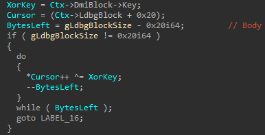
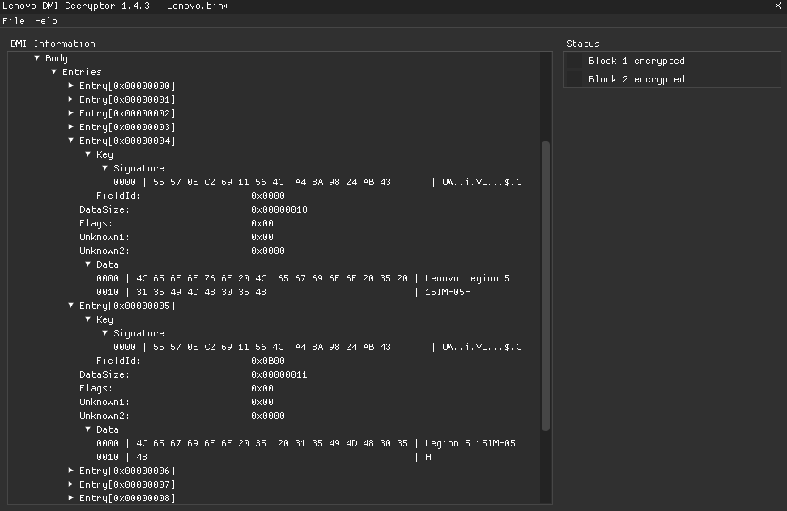

# Lenovo DMI Decryptor

A Windows tool for analyzing, decrypting, and reverse engineering Lenovo's proprietary DMI storage used in InsydeH2O firmware.

## Overview

Lenovo firmware maintains a custom data store identified by the `LENV` signature.
This storage is accessed through the proprietary `LENOVO_VARIABLE_PROTOCOL` which is installed by `LenovoVariableDxe` and used by multiple DXE drivers to retrieve and modify system information.
A separate data store identified by the `LDBG` signature tracks changes through time stamps.

## Storage Layout

The firmware uses fixed physical flash regions for storing these blocks. These addresses are hard-coded inside `LenovoVariableDxe`:

```c++
EFI_STATUS __fastcall GetLenvStorageLayout(
        EFI_PHYSICAL_ADDRESS *DmiBlock1Physical,
        UINT32 *DmiBlock1Size,
        EFI_PHYSICAL_ADDRESS *DmiBlock2Physical,
        UINT32 *DmiBlock2Size,
        EFI_PHYSICAL_ADDRESS *LdbgBlockPhysical,
        UINT32 *LdbgBlockSize)
{
  *DmiBlock1Physical = 0xFF622000;
  *DmiBlock1Size = 0x1000;
  *DmiBlock2Physical = 0xFF623000;
  *DmiBlock2Size = 0x1000;
  *LdbgBlockPhysical = 0xFF620000;
  *LdbgBlockSize = 0x2000;
  return 0i64;
}
```

Two redundant `LENV` blocks are maintained. The firmware selects the active one based on:

- `Generation`: higher (newer) is preferred
- Checksum validity

## Data Layout

```c++
#pragma pack(push, 1)						// Ensure no padding between fields
typedef struct _DMI_HEADER
{
	uint32_t		Signature;				// +0x00: "LENV"
	uint32_t		Generation;				// +0x04: "Generation" - LenovoVariableDxe prefers the newer block (highest generation). If a block's generation is 0, the block is considered invalid. Error if both blocks have 0 generation.
	uint32_t		Entries;				// +0x08: Number of DMI entries
	uint8_t			AccessFlag;				// +0x0C: 1 == read-only
	uint8_t			Key;					// +0x0D: XOR key
	uint16_t		Checksum;				// +0x0E: Additive 16-bit checksum of the body (excluding the header)
} DMI_HEADER, *PDMI_HEADER;

typedef struct _DMI_ENTRY_KEY
{
	uint8_t			Signature[0x0E];		// +0x00: Lenovo DMI entry signature / namespace identifier ("55 57 0E C2 69 11 56 4C A4 8A 98 24 AB 43" consumed by L05SmbiosOverride to retrieve SMBIOS data, "46 8F 44 64 23 6E 88 42 93 49 FD D8 87 C4" consumed by BdsDxe and OneKeyRecovery)
	uint16_t		FieldId;				// +0x0E: Per-entry identifier; together with Signature forms the lookup key for LENOVO_VARIABLE_PROTOCOL
} DMI_ENTRY_KEY, *PDMI_ENTRY_KEY;

typedef struct _DMI_DATA_ENTRY
{
	DMI_ENTRY_KEY	Key;					// +0x00: Lookup key used by LENOVO_VARIABLE_PROTOCOL
	uint32_t		DataSize;				// +0x10: Size of the data
	uint8_t			Flags;					// +0x14: bit0 appears to mark the entry as write-protected
	uint8_t			Unknown1;				// +0x15: Unknown
	uint16_t		Unknown2;				// +0x16: Unknown
	uint8_t			Data[1];				// +0x18: Actual data
} DMI_DATA_ENTRY, *PDMI_DATA_ENTRY;

typedef struct _DMI_DATA
{
	DMI_HEADER		Header;					// +0x00: DMI header
	DMI_DATA_ENTRY	Entry[1];				// +0x10: Array of DMI entries
} DMI_DATA, *PDMI_DATA;
#pragma pack(pop)
```

## Composite Lookup Key

Entries are not indexed by SMBIOS type. Instead, each entry is identified by:

```
(Key.Signature[14] + Key.FieldId)
```

`Signature` acts as namespace, `FieldId` acts as the identifier within that namespace. Together they form the lookup key used by `LENOVO_VARIABLE_PROTOCOL`.

## Firmware Interface

Access is performed via the `LENOVO_VARIABLE_PROTOCOL`:

```c++
using GetDmiEntryDataByKeyFn = EFI_STATUS(__fastcall)(PLENOVO_VARIABLE_PROTOCOL This, PDMI_ENTRY_KEY Key, PUINT32 Size, PVOID Data);
using SetDmiEntryDataByKeyFn = EFI_STATUS(__fastcall)(PLENOVO_VARIABLE_PROTOCOL This, PDMI_ENTRY_KEY Key, UINT32 Size, PVOID Data);
using ProtectDmiEntryByKeyFn = EFI_STATUS(__fastcall)(PLENOVO_VARIABLE_PROTOCOL This, PDMI_ENTRY_KEY Key, UINT32 Length, UINT32 Value);
using UnprotectDmiEntryByKeyFn = EFI_STATUS(__fastcall)(PLENOVO_VARIABLE_PROTOCOL This, PDMI_ENTRY_KEY Key, UINT32 Length, PUINT32 Value);

#pragma pack(push, 1)
typedef struct _LENOVO_VARIABLE_PROTOCOL
{
	GetDmiEntryDataByKeyFn*		GetDmiEntryDataByKey;
	SetDmiEntryDataByKeyFn*		SetDmiEntryDataByKey;
	ProtectDmiEntryByKeyFn*		ProtectDmiEntryByKey;
	UnprotectDmiEntryByKeyFn*	UnprotectDmiEntryByKey;
} LENOVO_VARIABLE_PROTOCOL, *PLENOVO_VARIABLE_PROTOCOL;
#pragma pack(pop)
```

- GUID: `BFD02359-8DFE-459A-8B69-A73A6BAFADC0`
- Installed by: `LenovoVariableDxe`
- Backed by SMM: `LenovoVariableSmm`

Function names are based on reverse engineering and likely differ from Lenovo's internal naming.
I have not fully reverse engineered the protocol yet, so some function signatures may be inaccurate. The overall structure and layout should be correct.

## SMBIOS Mapping

The mapping appears to be performed by `L05SmbiosOverride`. This mapping is:

- Not purely type-based
- Partially hard-coded
- Partially offset-based within the `LENV` structure

Therefore, modifying entry order, size, or layout is likely to break SMBIOS population.

## Encryption

Both `LENV` and `LDBG` blocks use a simple XOR scheme:

```c++
DecryptedByte = EncryptedByte ^ Key
```

The key is stored in the `DMI_HEADER`. Only the body is encrypted. The `LDBG` block does not store the key, but simply reuses the key from the active `LENV` block:



The encryption only applies to the body of the blocks.

## Integrity Check

The integrity check is a 16-bit additive checksum calculated over the encrypted body of the DMI data (excluding the header):

```c++
Checksum = Sum(Body) mod 2^16
```

## Example



## Precompiled Binary

For convenience, a precompiled binary is provided via the GitHub Releases page.